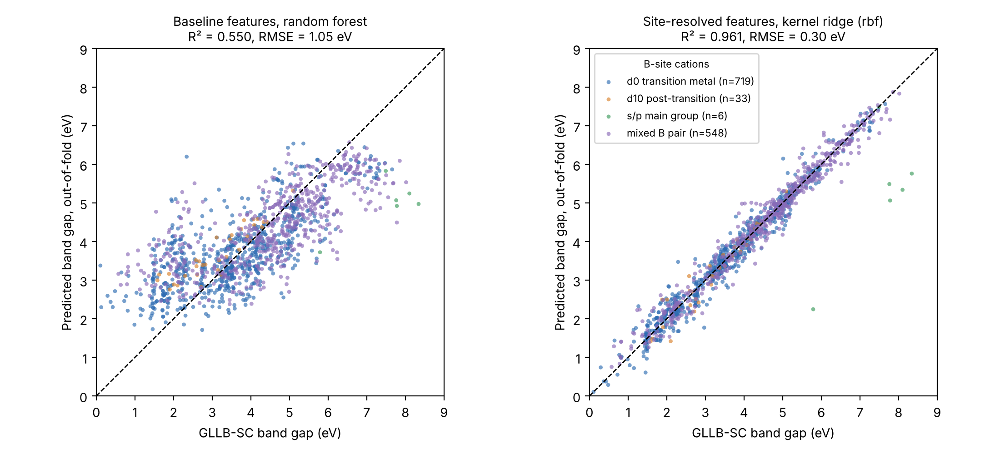
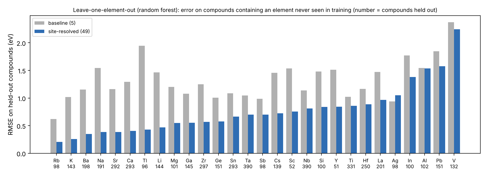
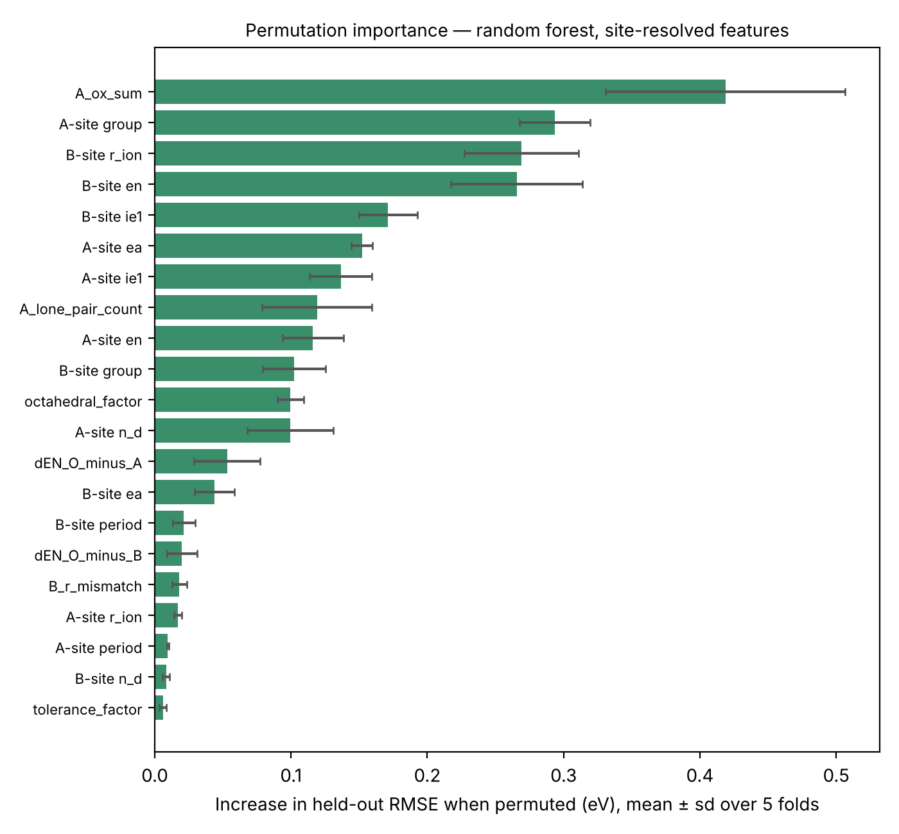

# Perovskite Band Gap Predictor

Predicts the band gap of double perovskite oxides, A A′ B B′ O₆, using
only the identities of the four cations. The project compares two ways
of turning a composition into features:

- **baseline**: 5 averages taken over every atom in the formula (the
  original version of this project), which ignore which cation sits on
  which crystal site;
- **site-resolved**: 49 descriptors that keep the A site (12-fold
  coordinated) and B site (6-fold, octahedral) separate.

Keeping the sites separate is the single biggest improvement: under
grouped 5-fold cross-validation the best model's error falls from
RMSE 1.05 eV (R² 0.55) to **RMSE 0.30 eV (R² 0.96)**.

All models (least squares, random forest, kernel ridge) are written from
scratch in numpy. A MATLAB version mirrors the features and evaluation
with built-in toolbox models.

**GT MSE Summer 2026 — Project 2** | Lucas Grisafi



## Dataset

1,306 double perovskite oxides from Pilania et al. (2016), distributed
as `double_perovskites_gap` by
[matminer](https://hackingmaterials.lbl.gov/matminer/dataset_summary.html)
([figshare](https://figshare.com/articles/dataset/Double_Perovskites_Gap_Data/7227728)).
Each row gives the formula, the A1/B1/A2/B2 site assignment and a band
gap computed with density functional theory using the GLLB-SC
functional in the GPAW code. GLLB-SC corrects much of the band gap
underestimation of standard functionals such as PBE.

- Gaps range from 0.11 to 8.34 eV (mean 4.01 eV, sd 1.58 eV). The
  original authors excluded metallic compounds, so every gap is > 0.
- 28 cations: 18 appear on the A site, 14 on the B site; Ga, In, Ge
  and Sn appear on both.
- 87 pairs of rows share the same two A cations and the same two B
  cations and differ only in how the A and B cations are paired up
  (e.g. AgTaCsNbO6 and CsTaAgNbO6).
  - In 51 pairs the gaps agree to within 5 meV, so they are effectively
    duplicates.
  - In the other 36 they differ by up to 0.65 eV (e.g. SnHfSrTiO6 at
    4.15 eV vs SrHfSnTiO6 at 3.49 eV).
  - Either way, each pair has identical site-resolved features, so the
    evaluation keeps both rows on the same side of every split. That
    leaves 1,219 groups.

> Pilania, G., Mannodi-Kanakkithodi, A., Uberuaga, B. P., Ramprasad, R.,
> Gubernatis, J. E. & Lookman, T. Machine learning bandgaps of double
> perovskites. *Sci. Rep.* **6**, 19375 (2016). doi:10.1038/srep19375

## Why the site matters

In these oxides the top of the valence band is made mostly of O 2p
states. The bottom of the conduction band is mostly set by the empty
states of the B-site cation, which sits inside an O₆ octahedron. The A
cation mainly sets the lattice, but it can also contribute
band-edge states (for example Ag⁺, Pb²⁺, Tl⁺ and Sn²⁺).

An average over all atoms cannot tell a Cs⁺ on the A site from an Nb⁵⁺
on the B site. The baseline features also include oxygen, which is 6
of every 10 atoms in every compound. That has two consequences:

- Three of the five baseline features are just the average over the
  four cations, shifted and rescaled.
- O is always the smallest atom, so the "radius ratio" feature is
  really the largest cation's radius ÷ 60 pm.

## Features

### Baseline (5, unchanged from v1)

These are weighted by how many atoms of each element are in the
formula (O counts 6 times). The values come from the v1 element table:
Pauling electronegativity, Slater (1964) atomic radii and a valence
electron count.

| Feature | Definition |
|---|---|
| Mean EN | weighted mean electronegativity |
| Std EN | unweighted std of EN over the 5 distinct elements |
| Mean radius | weighted mean atomic radius |
| Mean valence | weighted mean valence electrons |
| Radius ratio | largest / smallest radius (smallest is always O) |

### Site-resolved (49)

For each site (A, B) and each of 7 cation properties, the **min, max
and mean** over the two cations on that site (42 features). These
statistics don't depend on which cation is listed first. The 7
properties are:

- EN: Pauling electronegativity.
- r_ion: Shannon ionic radius, using the 12-fold value on the A site
  and the 6-fold value on the B site.
- IE1: first ionization energy.
- EA: electron affinity.
- period and group in the periodic table.
- n_d: d-electron count of the ion (d⁰ such as Ti⁴⁺, or d¹⁰ such as
  Sn⁴⁺).

Plus 7 structural and charge descriptors:

| Feature | Definition |
|---|---|
| tolerance_factor | Goldschmidt t = (r̄_A + r_O) / (√2 (r̄_B + r_O)) |
| octahedral_factor | μ = r̄_B / r_O |
| A_ox_sum | sum of the two A-site oxidation states (B-site sum = 12 − this) |
| A_lone_pair_count | number of lone-pair cations on A (Pb²⁺, Tl⁺, Sn²⁺, Ge²⁺, In⁺, Ga⁺) |
| B_r_mismatch | \|r_B1 − r_B2\|, B-site size disorder |
| dEN_O_minus_B | EN(O) − mean EN(B), B–O bond ionicity |
| dEN_O_minus_A | EN(O) − mean EN(A), A–O bond ionicity |

**Oxidation states.** Each cation gets one assumed oxidation state per
site: alkali 1+, alkaline earth 2+, La and Y 3+, Ag⁺, Tl⁺ and Pb²⁺ on
A; on B, Al/Ga/In/Sc are 3+, Si/Ge/Sn/Ti/Zr/Hf are 4+ and V/Nb/Ta/Sb
are 5+. When Ga, In, Ge or Sn sit on the A site they take their
lower, lone-pair states (Ga⁺, In⁺, Ge²⁺, Sn²⁺). With these choices
every one of the 1,306 compounds is exactly charge-balanced
(A + A′ + B + B′ = +12). A unit test checks this.

**Ionic radii** come from Shannon (1976), O²⁻ = 140 pm.

- The A site uses the 12-fold value where Shannon lists one.
  Otherwise it uses the highest coordination listed: 8-fold for Ag⁺,
  Li⁺ and Mg²⁺, 9-fold for Y³⁺, 6-fold for Ge²⁺.
- Ga⁺, In⁺ and Sn²⁺ have no Shannon entry. Their radii (120, 140 and
  118 pm) are rough estimates.
- Changing these three estimates by ±15 % moves the random forest's
  cross-validated R² by less than 0.002
  (`output/sensitivity_estimated_radii.csv`).

Electronegativity, ionization energy, electron affinity, period and
group come from `mendeleev` 1.3.0, hard-coded in
`python/element_data.py` and `matlab/site_props.m`.

## Evaluation

- **Grouped 5-fold cross-validation.** Rows that describe the same
  material share a group, so they never land on both sides of a
  train/test split. Feature scaling is fitted on each training fold
  only. Kernel ridge hyperparameters (α, γ) are tuned by an inner
  4-fold search on each training fold. Results are the mean ± sd of the
  5 held-out folds.
- **Leave-one-element-out (LOEO).** For each of the 28 cations, train
  on every compound that doesn't contain it, then predict every
  compound that does. This measures something harder than
  cross-validation: how well the model predicts chemistry it has never
  seen. Results are pooled over all held-out predictions.

## Results (Python, numpy-only; `python3 pipeline.py`)

### Grouped 5-fold cross-validation

| Features | Model | R² | RMSE (eV) | MAE (eV) |
|---|---|---|---|---|
| baseline (5) | Linear (OLS) | 0.215 ± 0.036 | 1.393 ± 0.091 | 1.138 ± 0.078 |
| baseline (5) | Random forest | 0.550 ± 0.041 | 1.054 ± 0.081 | 0.830 ± 0.055 |
| baseline (5) | Kernel ridge (RBF) | 0.554 ± 0.031 | 1.051 ± 0.091 | 0.792 ± 0.058 |
| site-resolved (49) | Linear (OLS) | 0.847 ± 0.017 | 0.615 ± 0.052 | 0.473 ± 0.038 |
| site-resolved (49) | Random forest | 0.941 ± 0.020 | 0.378 ± 0.076 | 0.262 ± 0.033 |
| site-resolved (49) | **Kernel ridge (RBF)** | **0.961 ± 0.023** | **0.304 ± 0.090** | **0.199 ± 0.019** |

What the table shows:

- **The features matter more than the model.** Plain least squares on
  the site-resolved features (R² 0.85) beats every model on the
  baseline features (R² ≤ 0.55).
- **The relationship is still nonlinear.** Random forest and kernel
  ridge add about 0.1 in R² over linear regression on the same
  features.

### Leave-one-element-out

| Features | Model | R² | RMSE (eV) | MAE (eV) |
|---|---|---|---|---|
| baseline (5) | Random forest | 0.316 | 1.304 | 1.037 |
| baseline (5) | Kernel ridge (RBF) | −0.050 | 1.616 | 1.226 |
| site-resolved (49) | **Random forest** | **0.723** | **0.831** | **0.593** |
| site-resolved (49) | Kernel ridge (RBF) | 0.633 | 0.955 | 0.709 |

Predicting a never-seen element is much harder than predicting a new
combination of known elements. RMSE is 2–3× higher than under
cross-validation. Site-resolved features still more than double R²
here. The model ranking also flips: random forest extrapolates better
than kernel ridge.



The hardest elements to extrapolate to are V (2.24 eV), Pb (1.58),
Al (1.54) and In (1.38). Each one's chemistry has no close analogue
among the other cations:

- V⁵⁺ has unusually low-lying empty 3d states.
- Pb²⁺ has a 6s² lone pair.
- Al³⁺ and Si⁴⁺ are the only B cations with no d shell.

### What drives the predictions



The chart shows permutation importance for the random forest on
held-out folds. Columns from the same family (for example the min,
max and mean of B-site EN) are shuffled together.

- **A_ox_sum is the strongest single descriptor.** Total cation charge
  is fixed at +12, so it also fixes the B-site charge. For example, a
  pair of 5+ B cations (Nb, Ta, V) requires low-charge A cations.
- **Next come the B-site ionic radius and electronegativity, and the
  A-site group.**
- **The tolerance factor contributes almost nothing.** It is a
  descriptor of structural stability, not of electronic structure.

Pilania et al. found something consistent with this: both sites
matter. Their best compact descriptor combined A-site orbital energies
with B-site electronegativities.

The descriptors are correlated with each other, so read these as
importances of feature families, not as causal effects.

### Comparison with the original paper

Pilania et al. used kernel ridge regression on elemental features,
including Kohn–Sham orbital energies and valence orbital radii, with
random 90/10 splits:

- 4-feature descriptor: test RMSE 0.50 eV, R² 0.90.
- 16-feature descriptor: RMSE ≈ 0.37 eV, R² ≈ 0.94.

Our grouped 5-fold result (RMSE 0.30 eV, R² 0.96) is in the same
range. The protocols differ (split sizes, grouping, feature
selection), so treat this as a sanity check, not a head-to-head
benchmark.

### Limitations

- **The target is a DFT band gap,** not an experimental one. GLLB-SC
  gaps are typically closer to experiment than PBE gaps, but they are
  not measurements.
- **Wide-gap s/p compounds are under-predicted.** Only 6 compounds
  have Al/Si on both B sites (gaps 5.8–8.3 eV). Kernel ridge
  under-predicts 5 of them by 2.3–3.5 eV out-of-fold; the model has
  too few examples of this chemistry.
- **36 pairs can't be told apart.** Their gaps differ by up to
  0.65 eV, but they differ only in which A cation is paired with which
  B cation, which the features don't encode. That puts a small floor
  under the achievable error.
- **Oxidation states and the three estimated radii are assumptions**
  (see Features). They do not affect the main results (sensitivity
  check above).
- **The model sees only which elements are on which site.** It has no
  information on structural distortion, octahedral tilts or B-site
  ordering, which are not in the dataset.

### MATLAB

`matlab/main.m` uses the same features and folds with `fitlm`,
`TreeBagger` (200 trees, min leaf 5, ⌈p/3⌉ predictors per split) and
`fitrsvm` (Gaussian kernel, `KernelScale 'auto'`). It:

- checks that its 49 site features match
  `output/site_features_python.csv` to 1e-9 (already verified in
  Octave: identical for all 1,306 compounds);
- reuses `output/cv_folds.csv`, so both languages are scored on the
  same splits.

Its result tables (`output/cv_results_matlab.csv`,
`output/loeo_results_matlab.csv`) are produced by running `main.m`;
they are not yet included in this repo. The MATLAB models differ from
the Python ones (`fitrsvm` uses an ε-insensitive loss instead of
kernel ridge's squared loss, and `TreeBagger`'s internals differ), so
expect similar but not identical numbers.

## How to run

**Python** (numpy + matplotlib; pytest for tests):

```bash
cd python
python3 pipeline.py                 # ~15 min on 2 CPU cores, writes ../output/
python3 pipeline.py --sensitivity   # + estimated-radius check (~3 min more)
python3 -m pytest tests -q          # unit tests
```

**MATLAB** (R2021a+, Statistics and Machine Learning Toolbox): run the
Python pipeline first so the shared feature and fold files exist, then

```matlab
cd matlab
main
```

## Repo layout

```
data/      double_perovskites_gap.csv   formula, a1, b1, a2, b2, gap_gllbsc
python/    element_data.py   element + site property tables (with sources)
           features.py       baseline_features, site_features
           models.py         OLS, random forest, RBF kernel ridge (numpy)
           evaluation.py     grouped K-fold, leave-one-element-out, importance
           pipeline.py       runs everything, writes output/
           tests/            pytest unit tests
matlab/    main.m, site_props.m, site_features.m, baseline_features.m,
           element_props.m, parse_formula.m, group_folds.m
output/    cv_results.csv, loeo_results.csv, loeo_rmse_by_element.csv,
           feature_importance_site.csv, sensitivity_estimated_radii.csv,
           site_features_python.csv, cv_folds.csv, *.png
docs/      design spec and implementation plan for the v2 changes
```

## Changes from v1

- **Site-resolved features** replace site-blind averages as the main
  feature set; the v1 features are kept as the baseline.
- **Evaluation:** grouped 5-fold cross-validation replaces the single
  80/20 split, which could put the two rows of a near-duplicate pair
  on opposite sides of the split. Leave-one-element-out is new.
- **Python code** is split into modules with unit tests.
- **Random forest bug fix:** a split threshold between two nearly equal
  values could round so that one child got no rows, producing an empty
  leaf.
- **Kernel ridge** tuning now happens inside each training fold, over
  a wider grid.
- **README:** v1's result tables predated the normalization-leakage fix
  and are replaced by numbers reproduced from `output/`.

## References

- Pilania et al., *Sci. Rep.* **6**, 19375 (2016). Dataset and original
  ML study.
- Shannon, R. D. *Acta Cryst.* A**32**, 751–767 (1976). Ionic radii.
- Goldschmidt, V. M. *Naturwissenschaften* **14**, 477–485 (1926).
  Tolerance factor.
- Ward, L. et al. *Comput. Mater. Sci.* **152**, 60–69 (2018).
  matminer.
