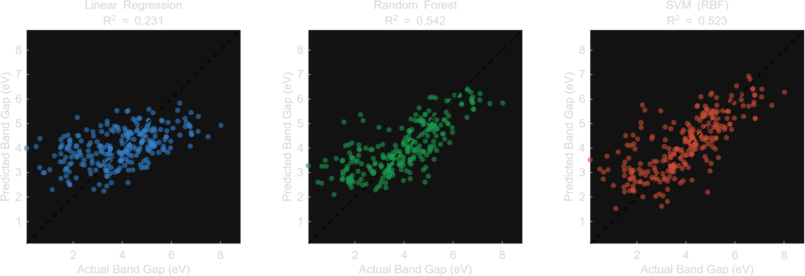
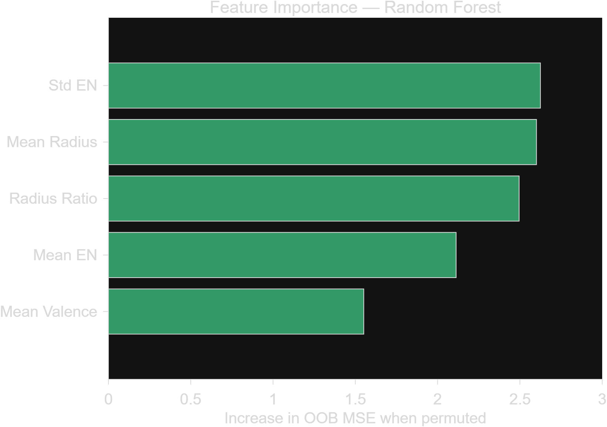

# Materials Informatics: Perovskite Band Gap Predictor

Machine learning pipeline that predicts the GLLB-SC band gap of double
perovskite oxides (A1B1A2B2O6) from five compositional descriptors built
directly from the chemical formula. Implemented twice: **MATLAB**
(Statistics and Machine Learning Toolbox — primary) and a dependency-light
**Python mirror** (numpy-only models, used to verify the pipeline end to end).

**GT MSE Summer 2026 — Project 2** | Lucas Grisafi

## Dataset

1,306 double perovskites with band gaps computed with the GLLB-SC
functional in GPAW — the canonical `double_perovskites_gap` dataset from
[matminer](https://hackingmaterials.lbl.gov/matminer/dataset_summary.html)
([figshare mirror](https://figshare.com/articles/dataset/Double_Perovskites_Gap_Data/7227728), MIT license).

> Pilania, G. et al. *Machine learning bandgaps of double perovskites.*
> Sci. Rep. **6**, 19375 (2016). doi:10.1038/srep19375

All 1,306 entries have gap > 0 eV (range 0.11–8.34 eV), 28 distinct
cations + O across the A/B sites.

## Features (5 compositional descriptors)

The physics: band gap depends on orbital overlap, which is governed by
electronegativity difference and atomic size. Each formula (e.g.
`AgNbLaAlO6`) is parsed by regex into elements + stoichiometric counts,
then mapped through an element property table (Pauling EN, Slater atomic
radius, valence electrons):

| # | Feature | Intuition |
|---|---------|-----------|
| 1 | Mean electronegativity (stoich-weighted) | ionicity of bonding |
| 2 | Std of electronegativity | chemical diversity / orbital mixing |
| 3 | Mean atomic radius (stoich-weighted) | lattice spacing, overlap |
| 4 | Mean valence electrons (stoich-weighted) | band filling |
| 5 | Max/min radius ratio | structural distortion proxy |

## Results

**MATLAB (primary, R2024+ run — 80/20 holdout, rng 42, 1045 train / 261 test):**

| Model | R² | RMSE (eV) |
|-------|------|-----------|
| Linear Regression (`fitlm`) | 0.231 | 1.331 |
| **Random Forest (`TreeBagger`, 100 trees)** | **0.542** | **1.028** |
| SVM RBF (`fitrsvm`) | 0.523 | 1.048 |

**Python mirror (numpy-only, 80/20 split, seed 42):**

| Model | R² | RMSE (eV) |
|-------|------|-----------|
| Linear Regression | 0.239 | 1.419 |
| **Random Forest (100 trees)** | **0.600** | **1.029** |
| Kernel Ridge / SVR (RBF) | 0.481 | 1.172 |

In both implementations Random Forest beats the linear baseline by
**2.3–2.5× in R²**, confirming the band gap–composition relationship is
strongly nonlinear. Python test-set permutation importance ranks **mean
electronegativity** first (ΔRMSE +0.48 eV when permuted); MATLAB's OOB
permutation importance ranks **std EN** and **mean radius** highest — the
five descriptors are correlated, so importance orderings shuffle across
splits/methods while electronegativity and size features consistently
dominate. For reference, Pilania et al. reach RMSE ≈ 0.5–0.6 eV using
~20 features including DFT-derived inputs; this model uses only 5
formula-derived descriptors.




## How to run

**MATLAB (R2021a+, Statistics and Machine Learning Toolbox):**
```matlab
cd matlab
main          % trains fitlm, TreeBagger, fitrsvm; writes ../output/
```
Outputs: `predicted_vs_actual.png`, `feature_importance.png`
(OOB permutation importance), `model_comparison_matlab.csv`.

**Python (numpy + matplotlib only — models implemented from scratch):**
```bash
cd python
python3 bandgap_pipeline.py
```

## Repo layout

```
data/      double_perovskites_gap.csv  (formula, site assignments, gap)
matlab/    main.m, parse_formula.m, element_props.m
python/    bandgap_pipeline.py, element_data.py
output/    figures + model comparison tables
```

##